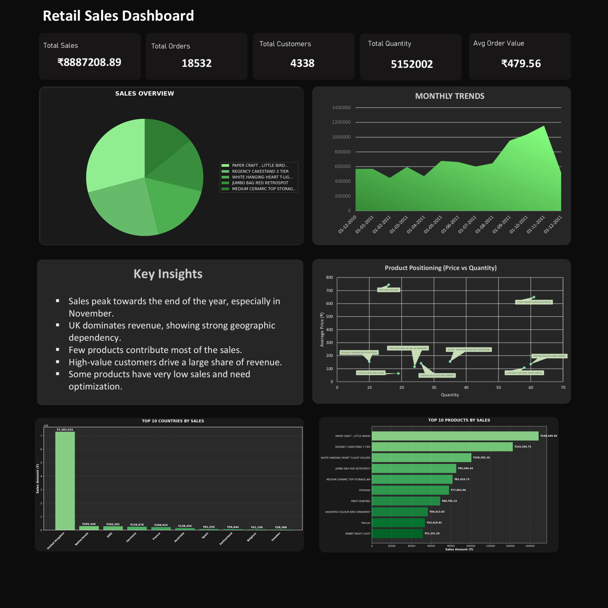

# FUTURE_DS_01
# 📋 Business Sales Performance Analytics

## 🎯 Objective
Analyze retail sales data to identify key trends, top-performing products, customer behavior, and country-wise performance to support data-driven business decisions.

---

## 🛠️ Tools Used
- Python (Pandas, NumPy)
- Matplotlib
- Excel (Dashboard & Visualization)

---

## 📁 Dataset
Online Retail Dataset containing transactional sales data including products, customers, quantity, pricing, and country information.

---

## ⚙️ Workflow
- Data Cleaning (handling missing values, removing duplicates)
- Feature Engineering (Revenue calculation)
- KPI Analysis (Sales, Orders, Customers, AOV)
- Trend Analysis (Monthly sales performance)
- Product Analysis (Top & worst products)
- Country Analysis (Revenue by region)
- Dashboard Creation (Excel-based visualization)

---

## 🔍 Key Insights

- The business generated a total revenue of **₹8,887,208.89** from **18,532 orders** and **4,338 customers**, with an average order value of **₹479.56**.

- Sales show a **strong seasonal trend**, with peak performance in **November**, indicating high demand towards the end of the year.

- The **United Kingdom alone contributed ₹7,285,024.64**, accounting for the majority of total revenue, showing strong geographic dependency.

- The top-performing product **"PAPER CRAFT, LITTLE BIRDIE" generated ₹168,469.60**, followed by **"REGENCY CAKESTAND 3 TIER" (₹142,264.75)**, indicating product concentration.

- A small group of customers contributes significantly to revenue, with the top customer generating over **₹280,206**, highlighting customer dependency.

---

## 💡 Recommendations

- Expand into **new geographic markets** to reduce heavy reliance on the UK.

- Focus on **high-performing and premium products** such as top-selling items to maximize revenue.

- Develop strategies to **reduce dependency on top customers** by increasing the overall customer base.

- Improve pricing and bundling strategies to increase **average order value beyond ₹479.56**.

- Optimize inventory by reducing **low-performing products** and prioritizing high-demand items.

---

## 📸 Dashboard Preview

Example:

---

## 📌 Conclusion

The analysis shows that the business is generating strong revenue with consistent customer engagement. However, there is a high dependency on the UK market, a few top products, and key customers. By diversifying markets, improving product strategy, and expanding the customer base, the business can achieve more sustainable and scalable growth.